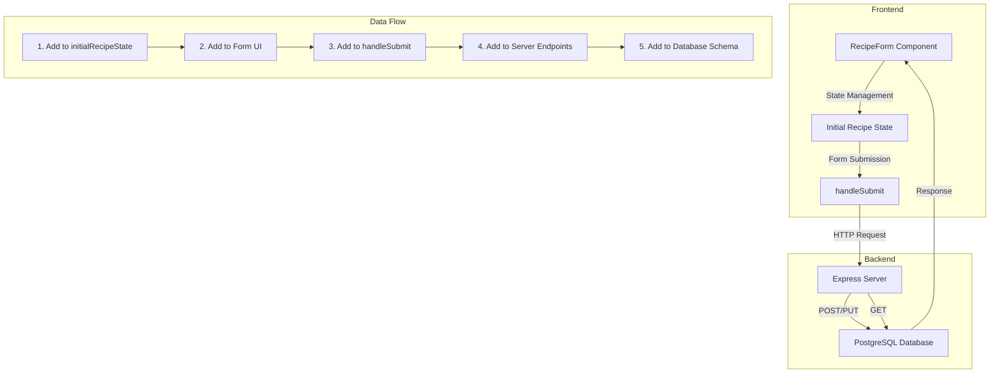

# Field Addition Guide for Recipe Management System

## System Architecture Diagram


## Step-by-Step Guide for Adding New Fields

### 1. Frontend: Initial State (RecipeForm.js)
```javascript
const initialRecipeState = {
  // Existing fields...
  new_field: '', // Add your new field here
};
```

### 2. Frontend: Form UI (RecipeForm.js)
```javascript
<div className="form-group">
  <label>New Field</label>
  <input
    type="text"
    name="new_field"
    value={recipe.new_field || ''}
    onChange={handleInputChange}
    className="form-control"
  />
</div>
```

### 3. Frontend: Form Submission (RecipeForm.js)
```javascript
const submissionData = {
  ...recipe,
  // Add field to submission with proper formatting
  new_field: recipe.new_field?.trim() || '',
};
```

### 4. Backend: Server Endpoints (server.js)

#### POST Endpoint
```javascript
app.post('/api/recipes', async (req, res) => {
    const { 
        // Existing destructured fields...
        new_field
    } = req.body;
    
    // Add to SQL query
    const recipeResult = await pool.query(
        `INSERT INTO recipes 
        (...existing_fields, new_field) 
        VALUES (...$1, $2) 
        RETURNING *`,
        [...existing_values, new_field || '']
    );
});
```

#### PUT Endpoint
```javascript
app.put('/api/recipes/:id', async (req, res) => {
    // Add to UPDATE query
    const result = await pool.query(
        `UPDATE recipes 
        SET 
            ...existing_fields,
            new_field = $n
        WHERE id = $id
        RETURNING *`,
        [...existing_values, req.body.new_field || '']
    );
});
```

### 5. Database: Schema Update
```sql
ALTER TABLE recipes
ADD COLUMN new_field TEXT DEFAULT '';
```

## Field Type Guidelines

### Text Fields
- Default to empty string: `''`
- Trim on submission: `field?.trim() || ''`
- Use `TEXT` type in PostgreSQL

### Numeric Fields
- Default to zero: `0`
- Parse on submission: `parseFloat(field) || 0`
- Use appropriate numeric type in PostgreSQL (`INTEGER`, `DECIMAL`, etc.)

### Boolean Fields
- Default to false: `false`
- No parsing needed
- Use `BOOLEAN` type in PostgreSQL

### Array/JSON Fields
- Default to empty array: `[]`
- Ensure proper serialization
- Use `JSONB` type in PostgreSQL

## Image Field Handling Best Practices

When adding image fields to the system, follow these guidelines:

### Frontend Considerations
```javascript
// 1. Validate file size and type
if (file.size > 5 * 1024 * 1024) {
    setError('Image size must be less than 5MB');
    return;
}

if (!file.type.startsWith('image/')) {
    setError('Please upload a valid image file');
    return;
}

// 2. Compress images before storage
const canvas = document.createElement('canvas');
const ctx = canvas.getContext('2d');
// Set max dimensions while maintaining aspect ratio
const maxDimension = 800;
// ... compression logic ...
const compressedDataUrl = canvas.toDataURL('image/jpeg', 0.7);
```

### Backend Considerations
```javascript
// 1. Validate image data format
if (imageUrl && !imageUrl.startsWith('data:image/')) {
    throw new Error('Invalid image data format');
}

// 2. Handle image fields in transactions
await pool.query('BEGIN');
try {
    // Process image data
    await pool.query('COMMIT');
} catch (err) {
    await pool.query('ROLLBACK');
    throw err;
}
```

### Best Practices
1. Always validate file size and type on the frontend
2. Compress large images to reduce storage and bandwidth
3. Use proper error handling for image processing
4. Store images as data URLs or consider using cloud storage for production
5. Include image validation in database transactions
6. Provide clear error messages for image-related issues

## Common Pitfalls

1. **Controlled Component Issues**
   - Always provide default values
   - Handle null/undefined cases
   - Use proper type conversion

2. **Data Type Mismatches**
   - Ensure consistency across frontend, backend, and database
   - Use appropriate parsing functions
   - Handle edge cases

3. **Missing Field in Submission**
   - Add field to submissionData object
   - Include in SQL queries
   - Add default values

## Testing New Fields

1. **Frontend Testing**
   - Verify form renders correctly
   - Test input handling
   - Validate submission data

2. **Backend Testing**
   - Test POST/PUT endpoints
   - Verify data persistence
   - Check error handling

3. **Integration Testing**
   - Complete form submission flow
   - Data retrieval and display
   - Edit functionality

## Example: Adding delivery_packaging Field

### 1. Initial State
```javascript
const initialRecipeState = {
  delivery_packaging: '',
};
```

### 2. Form UI
```javascript
<div className="form-group">
  <label>Delivery Packaging</label>
  <textarea
    name="delivery_packaging"
    value={recipe.delivery_packaging || ''}
    onChange={handleInputChange}
    className="form-control"
    placeholder="Describe packaging materials and instructions..."
  />
</div>
```

### 3. Submission Data
```javascript
const submissionData = {
  ...recipe,
  delivery_packaging: recipe.delivery_packaging?.trim() || '',
};
```

### 4. Database Schema
```sql
ALTER TABLE recipes
ADD COLUMN delivery_packaging TEXT DEFAULT '';
```

## Best Practices

1. **Naming Conventions**
   - Use snake_case for database columns
   - Be consistent across all layers
   - Use descriptive names

2. **Default Values**
   - Always provide sensible defaults
   - Handle null/undefined cases
   - Document default behavior

3. **Type Safety**
   - Use proper type conversion
   - Validate data formats
   - Handle edge cases

4. **Documentation**
   - Update schema documentation
   - Document new features
   - Keep README current
